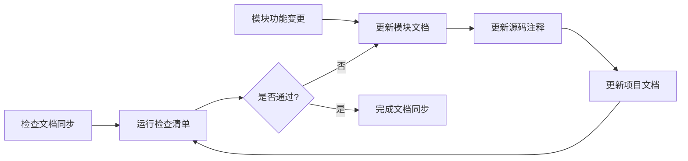

# 贡献指南

[](https://github.com/eframework-org/GO.UTIL/graphs/contributors)
[](https://github.com/eframework-org/GO.UTIL/graphs/commit-activity)
[](https://github.com/eframework-org/GO.UTIL/commits/master)
[](https://github.com/eframework-org/GO.UTIL/issues)
[](https://github.com/eframework-org/GO.UTIL/actions/workflows/test.yml)

感谢您考虑为本项目做出贡献！

## 技术路线

### 1. 开发语言
- Go 1.23+：主要开发语言
- 遵循 Go 语言规范和最佳实践

### 2. 开发工具
- go test：单元测试
- Cursor/VS Code: 代码编辑器

### 3. 集成工具
- Github Action：提供了自动化测试及发布工作流

## 目录规范

### 1. 目录结构
```
<Root>/                    # 项目目录
│
├── .github/               # 工作流目录
│   └── workflows/*.yml    # 工作流脚本
│
├── <Module>/              # 模块目录
│   ├── doc.go             # 模块注释
│   ├── *.go               # 模块实现
│   ├── *_test.go          # 模块测试
│   └── README.md          # 模块文档
├── ...
│
├── go.mod                 # 项目配置
├── go.sum                 # 项目依赖
├── README.md              # 项目文档
├── CHANGELOG.md           # 更新记录
├── CONTRIBUTING.md        # 贡献指南
├── LICENSE                # 开源协议
└── .gitignore             # Git忽略
```

### 2. 命名规范

1. 目录命名
   - 模块目录使用 PascalCase 命名法，如：`Hello`、`World`、`Greet`
   - 专有目录使用通用命名规范，如：`.github`、`workflows`、`node_modules`

2. 文件命名
   - 源代码文件使用 snake_case 命名法，如：`hello.go`、`hello_world.go`、`greet_test.go`
   - 专有文件使用通用命名规范，如：`README.md`、`.gitignore`

## 文档规范

### 1. 语言规范
- 首选语言：中文
- 专有名词保持原文，如：Node.js、TypeScript
- 中英文之间需要空格，如：Hello 你好

### 2. 标点规范
- 中文文档使用中文标点
- 代码示例使用英文标点

### 3. 格式规范
- 使用 Markdown 编写文档
- 标题使用 ATX 风格（#）
- 列表使用短横线（-）作为标记
- 代码块使用三个反引号（```）
- 文件末尾保留一个空行

### 4. 链接规范
- 使用相对路径链接项目内文件
- 使用完整 URL 链接外部资源
- 锚点使用小写，空格替换为连字符

### 5. 文档模板

#### 项目文档
文件路径：`<项目目录>/README.md`

```markdown
# <项目名称>

[](https://pkg.go.dev/<组织名称>/<项目名称>)
[](https://github.com/<组织名称>/<项目名称>/tags)
[](https://goreportcard.com/report/<组织名称>/<项目名称>)

<项目名称> 提供了/是一个/实现了 <核心功能>，支持/用于 <主要特性>。

## 功能特性

- [<模块1名称>](<模块1目录>/README.md) <模块1简介>
- [<模块2名称>](<模块2目录>/README.md) <模块2简介>
- ...

## 常见问题

### 1. <问题描述>
<问题详情>

...

更多问题，请查阅[问题反馈](CONTRIBUTING.md#问题反馈)。

## 项目信息

- [更新记录](CHANGELOG.md)
- [贡献指南](CONTRIBUTING.md)
- [许可证](LICENSE)
```

#### 模块文档
文件路径：`<模块目录>/README.md`

```markdown
# <模块名称>

[](https://pkg.go.dev/<组织名称>/<项目名称>/<模块名称>)
[](https://github.com/<组织名称>/<项目名称>/tags)
[](https://goreportcard.com/report/<组织名称>/<项目名称>)

<模块名称> 提供了/是一个/实现了 <核心功能>，支持/用于 <主要特性>。

## 功能特性

- 支持/提供 XXX：具体说明
- 实现了 XXX：具体说明
- ...

## 使用手册

### 1. <功能类别1>

#### 1.1 <具体功能>
<功能说明和示例（参考测试用例编写）>

...

## 常见问题

### 1. <问题描述>
<问题详情>

...

更多问题，请查阅[问题反馈](<相对于项目目录>/CONTRIBUTING.md#问题反馈)。

## 项目信息

- [更新记录](<相对于项目目录>/CHANGELOG.md)
- [贡献指南](<相对于项目目录>/CONTRIBUTING.md)
- [许可证](<相对于项目目录>/LICENSE)
```

#### 模块注释
文件路径：`<模块目录>/doc.go`

```go
// Copyright (c) 2025 EFramework Organization. All rights reserved.
// Use of this source code is governed by a MIT-style
// license that can be found in the LICENSE file.

/*
<模块名称> 提供了/是一个/实现了 <核心功能>，支持/用于 <主要特性>。

功能特性

    - <特性1>
    - <特性2>
    - ...

使用手册

1. <功能类别1>

1.1 <具体功能>

    <功能说明和示例（参考测试用例编写）>

...

更多信息请参考模块文档。
*/
package <模块名称>
```

### 6. 文档同步

#### 同步范围

##### 1. 项目级同步
- 项目文档（`<项目目录>/README.md`）功能特性章节中各模块的描述应与其文档（`<模块目录>/README.md`）保持一致，以模块文档为准

##### 2. 模块级同步
- 模块文档（`<模块目录>/README.md`）具有最高优先级，是模块的主要文档
- 模块源码（`<模块目录>/doc.go`）的注释应与模块文档保持一致，以模块文档为准
- 项目文档（`<项目目录>/README.md`）中的模块描述应与模块文档保持一致，以模块文档为准

##### 3. 功能级同步
- 文档功能描述更新
- 示例代码同步更新
- 功能使用说明补充

#### 检查清单

##### 1. 描述一致性
- [ ] 项目描述一致性
- [ ] 模块描述一致性

##### 2. 功能完整性
- [ ] 功能列表完整性
- [ ] 示例代码正确性

##### 3. 链接有效性
- [ ] 文档内部链接检查
- [ ] 外部资源链接检查

#### 同步流程



## 代码规范

### 1. 代码风格
- 使用 `gofmt` 格式化代码
- 使用 4 空格缩进（转换为 tab）
- 遵循 Go 官方代码规范
- 版权声明、类、函数之间及文件末尾保留一个空行

### 2. 命名规范
- 模块名：使用 PascalCase
- 文件名：使用 snake_case
- 类名：使用 PascalCase
- 函数名：使用 PascalCase
- 变量名：使用 camelCase
- 常量名：使用 PascalCase

### 3. 注释规范

1. 基本要求
   - 遵循 [Go Doc](https://go.dev/doc/comment) 规范，必须是完整的自然语句
   - 遵循[语言规范](#1-语言规范)和[标点规范](#2-标点规范)
   - 导出的标识符必须包含注释说明其用途

2. 注释模板
   ```go
   // Copyright (c) 2025 EFramework Organization. All rights reserved.
   // Use of this source code is governed by a MIT-style
   // license that can be found in the LICENSE file.

   // Handler 定义了数据处理的基础接口。
   // 实现此接口的类型可以参与数据处理流程。
   type Handler interface {
       // Init 执行初始化操作。
       // 返回 error 表示初始化失败的原因。
       Init() error

       // Process 处理输入的数据。
       // 输入待处理的数据，返回处理结果和可能的错误。
       Process(data any) (any, error)

       // Close 执行清理操作。
       // ctx 用于控制清理操作的超时。
       Close(ctx context.Context)
   }

   // ErrInvalidInput 表示输入数据不符合要求。
   var ErrInvalidInput = errors.New("无效的输入数据")

   // DefaultConfig 定义默认的配置参数。
   const DefaultConfig = "default_config"
   ```

## 提交规范

### 1. 分支命名
- 功能分支：`feature/功能名称`
- 修复分支：`fix/问题描述`
- 优化分支：`optimize/优化内容`

### 2. 提交信息
- 遵循[语言规范](#1-语言规范)和[标点规范](#2-标点规范)
```
<类型>: <描述>

[可选的详细描述]

[可选的关闭问题]
```

- 类型包括：
  - `feat`: 新功能
  - `fix`: 修复问题
  - `docs`: 文档更新
  - `style`: 代码格式调整
  - `refactor`: 代码重构
  - `perf`: 性能优化
  - `test`: 测试相关
  - `chore`: 构建过程或辅助工具的变动

### 3. 提交模板
```
feat: 添加XX功能
- 添加了XX特性A
- 优化了XX流程B
- 更新相关文档
  
详细说明此功能的主要变更和影响范围
  
Closes #123
```

## 测试规范

### 1. 基本要求
- 核心功能必须有单元测试
- 保持较高的测试覆盖率

### 2. 代码模板
- 源码头部包含版权声明
- 函数名称使用 PascalCase 命名法

```go
// Copyright (c) 2025 EFramework Organization. All rights reserved.
// Use of this source code is governed by a MIT-style
// license that can be found in the LICENSE file.

func TestXxx(t *testing.T) {
   // 准备测试数据（Arrange）
   
   // 执行测试功能（Act）
   
   // 验证测试结果（Assert）
}
```

## 开发流程

### 1. 环境准备
```bash
# 克隆仓库
git clone https://github.com/eframework-org/GO.UTIL.git
cd GO.UTIL

# 安装依赖
go mod tidy
```

### 2. 开发调试
```bash
# 运行测试
go test ./...
```

## 发布流程

### 1. 运行单元测试
- 使用 `go test` 运行所有单元测试
### 2. 检查文档同步
- 按照[文档模板](#5-文档模板)检查单个文档是否符合规范
- 按照[文档同步](#6-文档同步)检查关联文档之间是否同步

### 3. 更新修改记录
- 使用年月日格式：`YYYY-MM-DD`
- 按版本号降序排列
- 分类记录变更内容：
  ```markdown
  ## [1.0.0] - 2024-03-21
  ### 新增
  - 添加了新功能 A
  - 添加了新功能 B
  
  ### 优化
  - 优化了功能 C 的性能
  - 改进了功能 D 的用户体验
  
  ### 修复
  - 修复了问题 E
  - 修复了问题 F
  
  ### 变更
  - 调整了配置项 G
  - 更新了依赖库版本
  ```

### 4. 发布至注册表
- 确定版本：遵循[语义化版本 2.0.0](https://semver.org/lang/zh-CN/)
- 发布版本：运行[版本发布](https://github.com/eframework-org/GO.UTIL/actions/workflows/publish.yml)工作流

## 问题反馈

### 1. 问题检索
- 查阅[议题](https://github.com/eframework-org/GO.UTIL/issues)避免重复
- 确认可以稳定重现
- 提供必要环境信息

### 2. 问题报告
```markdown
### 问题描述
[清晰简洁的问题描述]

### 重现步骤
1. [步骤1]
2. [步骤2]
3. [步骤3]

### 期望行为
[描述期望的结果]

### 实际行为
[描述实际的结果]

### 环境信息
- Go 版本：如 1.23.5
- 操作系统：如 Windows 11
- 依赖版本：如 0.0.1
```

## 许可证

通过提交代码，您同意将您的代码贡献置于 MIT [许可证](LICENSE)之下。
