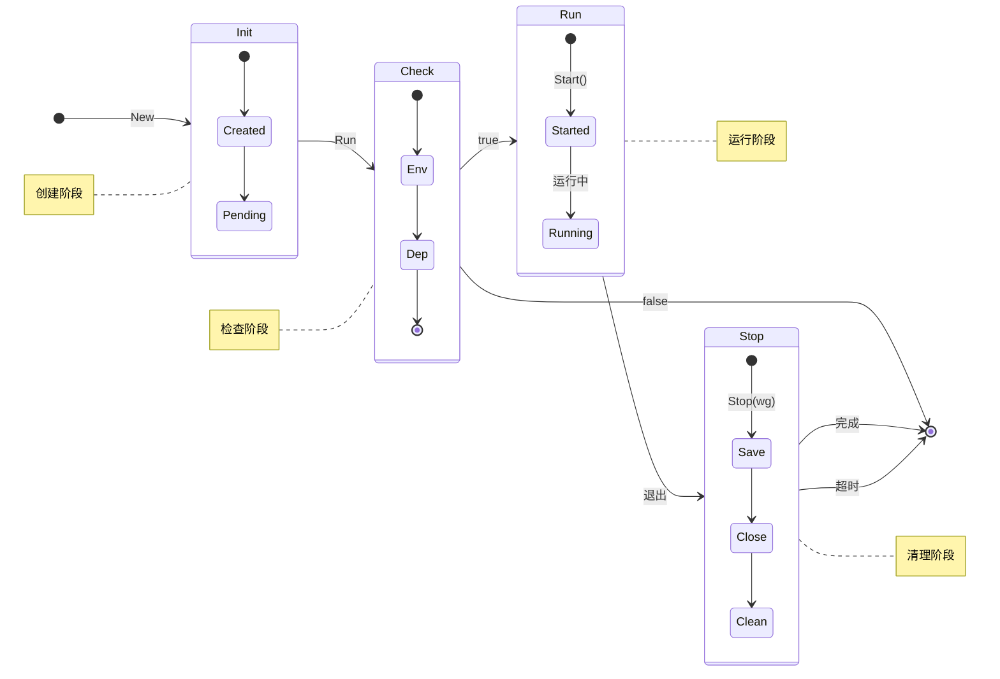

# XApp

[](https://pkg.go.dev/github.com/eframework-org/GO.UTIL/XApp)
[](https://github.com/eframework-org/GO.UTIL/tags)
[](https://goreportcard.com/report/github.com/eframework-org/GO.UTIL)

XApp 提供了应用程序生命周期管理功能，用于控制应用程序的启动、运行和退出过程。

## 功能特性

- 应用程序生命周期管理：提供 Awake、Start、Stop 等生命周期函数
- 优雅的启动和退出：支持启动前环境检查和退出时的资源清理
- 泛型单例模式：内置 Base[T] 泛型基类，支持在应用的任意位置获取应用实例

## 使用手册

### 1. 生命周期
应用程序的生命周期状态转换如下：



#### 1.1 应用启动
应用程序需要实现 `IBase` 接口或继承 `Base[T]` 泛型基类：

```go
// 定义应用结构体
type MyApp struct {
    XApp.Base[MyApp] // 内嵌泛型基类
}

// 可选：重写生命周期方法
func (app *MyApp) Awake() bool {
    return true
}

func (app *MyApp) Start() {
    // 启动时的初始化代码
    // tips：要保证不阻塞当前方法
}

func (app *MyApp) Stop(wg *sync.WaitGroup) {
    // 退出时的清理代码
}

// 运行应用
app := XObject.New[MyApp]()
XApp.Run(app)
```

#### 1.2 应用退出
通过调用 `Quit` 函数触发应用退出：

```go
XApp.Quit()
```

### 2. 单例访问

#### 2.1 获取应用实例
在任意位置通过 `Shared` 函数获取应用实例：

```go
instance := XApp.Shared[*MyApp]()
```

## 常见问题

### 1. 如何处理多个应用实例？
XApp 设计为单例模式，每个应用类型只能有一个实例。如果需要管理多个实例，建议通过应用内部的组件或服务来实现。

更多问题，请查阅[问题反馈](../CONTRIBUTING.md#问题反馈)。

## 项目信息

- [更新记录](../CHANGELOG.md)
- [贡献指南](../CONTRIBUTING.md)
- [许可证](../LICENSE)
