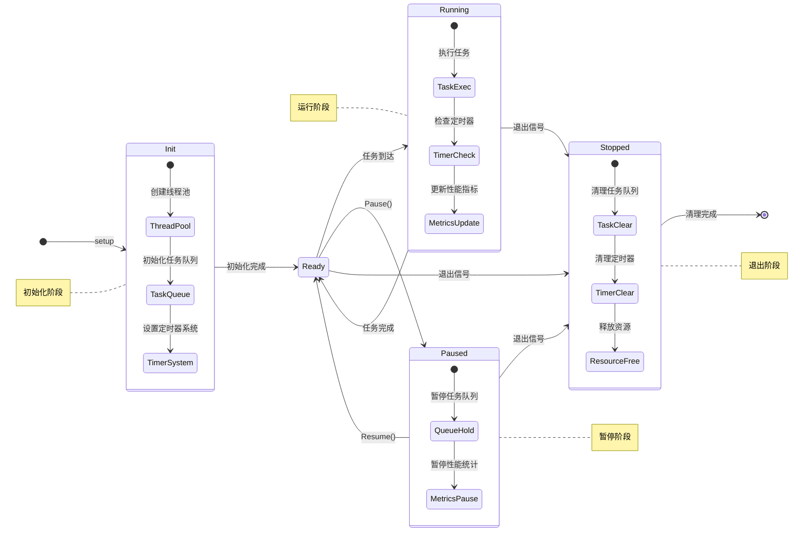

# XLoom

[](https://pkg.go.dev/github.com/eframework-org/GO.UTIL/XLoom)
[](https://github.com/eframework-org/GO.UTIL/tags)
[](https://goreportcard.com/report/github.com/eframework-org/GO.UTIL)

XLoom 提供了一个轻量级的任务调度系统，用于管理异步任务、定时器和多线程并发。

## 功能特性

- 异步任务：支持执行和异常恢复异步任务
- 线程管理：支持任务管理、线程暂停/恢复控制、指标监控（FPS/QPS）
- 定时器管理：支持设置/取消超时和间歇调用

## 使用手册

### 1. 异步任务

#### 1.1 基础异步执行
```go
// 无参数异步执行
XLoom.RunAsync(func() {
    // 异步代码
})

// 带参数异步执行
XLoom.RunAsyncT1(func(id int) {
    fmt.Printf("Task %d\n", id)
}, 1)

// 带异常恢复的异步执行
XLoom.RunAsync(func() {
    panic("recoverable")
}, true) // true 表示发生异常时重试
```

### 2. 线程管理
线程调度系统运行机理如下：



#### 2.1 任务调度
```go
// 在指定线程执行任务
XLoom.RunIn(func() {
    fmt.Println("在线程0中执行")
}, 0)

// 获取当前线程 loom ID
pid := XLoom.ID()

// 获取线程性能指标
fps := XLoom.FPS(0) // 线程0的帧率
qps := XLoom.QPS(0) // 线程0的处理速率
```

#### 2.2 线程控制
```go
// 暂停/恢复单个线程
XLoom.Pause(0)  // 暂停线程0
XLoom.Resume(0) // 恢复线程0

// 暂停/恢复所有线程
XLoom.Pause()
XLoom.Resume()
```
#### 2.3 指标监控

支持 `Prometheus` 指标监控，可以实时监控线程的性能和资源使用情况：

| 指标 | 类型 | 描述 |
|------|------|------|
| `xloom_fps_{n}` | Gauge | 第 n 个线程的每秒刷新帧率 |
| `xloom_qps_{n}` | Gauge | 第 n 个线程的每秒处理任务数 |
| `xloom_query_total_{n}` | Counter | 第 n 个线程已处理的任务总数 |
| `xloom_query_total` | Counter | 所有线程已处理的任务总数 |

#### 2.4 可选配置

支持通过首选项配置对线程系统进行调整：

配置参数：

- `Loom/Count`：线程池大小，默认为 1
- `Loom/Step`：线程更新频率（毫秒），默认为 10
- `Loom/Queue`：每个线程的任务队列容量，默认为 50000

配置示例：

```json
{
    "Loom/Count": 8,
    "Loom/Step": 10,
    "Loom/Queue": 50000
}
```

### 3. 定时器管理

#### 3.1 超时调用
```go
// 延迟执行
id := XLoom.SetTimeout(func() {
    fmt.Println("1秒后执行")
}, 1000)

// 取消超时调用
XLoom.ClearTimeout(id)
```

#### 3.2 间歇调用
```go
// 周期执行
id := XLoom.SetInterval(func() {
    fmt.Println("每秒执行一次")
}, 1000)

// 取消间歇调用
XLoom.ClearInterval(id)
```

## 常见问题

### 1. 如何选择合适的线程数？
- 建议根据 CPU 核心数设置线程数
- 考虑任务类型和负载情况：
  - IO 密集型任务可以设置更多线程
  - CPU 密集型任务建议与 CPU 核心数相当
- 通过监控 FPS/QPS 调整线程数量
- 建议从小规模开始，根据指标监控逐步调整

### 2. 定时器精度问题？
定时器精度受以下因素影响：
- 线程更新频率：调整 Step 参数可提高精度
- 系统调度：受操作系统调度影响
- 任务队列：大量任务可能导致延迟
建议：
- 对精度要求高的场景使用 time.Timer
- 关键定时任务使用独立线程
- 避免在定时器回调中执行耗时操作

### 3. 性能优化建议
1. 线程管理：
   - 合理分配任务到不同线程
   - 避免线程间频繁任务迁移
   - 监控线程性能指标及时调整

2. 任务调度：
   - 使用对象池减少内存分配
   - 批量处理小任务减少调度开销
   - 避免过多的跨线程调用

3. 异常处理：
   - 合理使用异常恢复机制
   - 避免在关键路径抛出异常
   - 记录异常信息便于问题排查

更多问题，请查阅[问题反馈](../CONTRIBUTING.md#问题反馈)。

## 项目信息

- [更新记录](../CHANGELOG.md)
- [贡献指南](../CONTRIBUTING.md)
- [许可证](../LICENSE)
